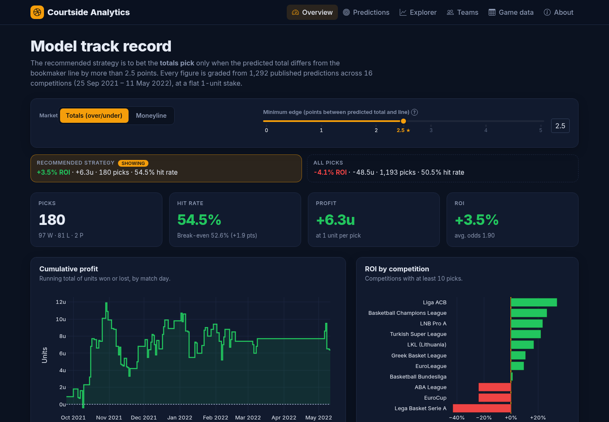

# Courtside Analytics: basketball betting dashboard

[](https://github.com/Konstantinos-Sakellariou/betting-dashboard/actions/workflows/ci.yml)

This dashboard shows how a basketball score-prediction model performed across EuroLeague, EuroCup, the NBA and nine European domestic leagues. It includes 35,000 historical games you can explore.

- **The track record is honest.** Every one of the 1,292 published picks is graded against the final score, and each market shows hit rate, profit in units and ROI next to its break-even point.
- **Predictions show each game's forecast.** You see the predicted score, the over/under pick against the bookmaker line, and the moneyline pick.
- **The league explorer** covers scoring trends, home advantage, and a scatter plot of any two variables across 11 leagues and 11 seasons (2010–2021).
- **Team profiles** show a team's record, points for and against by season, home/away splits, and over/under history.
- **Game data** is a searchable table of every game, with odds and lines. Rows load from the server as you scroll, and you can export to CSV.



| Predictions | Explorer | Teams |
|---|---|---|
|  |  |  |

## Quick start

You need [uv](https://docs.astral.sh/uv/). It installs Python 3.13 for you if it's missing.

```bash
uv sync                                   # create .venv from uv.lock
uv run python -m betting_dashboard.app    # http://localhost:8050
```

Or run it with Docker:

```bash
docker build -t betting-dashboard .
docker run -p 8050:8050 betting-dashboard
```

## Development

```bash
uv run pytest                      # unit + app smoke tests
uv run ruff check . && uv run ruff format .
uv run python scripts/build_data.py   # rebuild data/processed from data/raw
```

CI runs the same steps on every push. It also checks that `data/processed` rebuilds byte-for-byte from `data/raw`, and it builds and smoke-tests the Docker image.

### Project layout

```
src/betting_dashboard/
  app.py            Dash app factory; gunicorn serves betting_dashboard.app:server
  config.py         settings from environment variables (see .env.example)
  data/             schema contracts, cleaning rules, cached loaders
  analytics/        pure functions: pick grading, ROI, team/league aggregates, grid queries
  components/       navbar/footer, KPI cards, AG Grid defaults, Plotly theme
  pages/            overview, predictions, explorer, teams, games, about
  assets/           CSS, favicon, vendored Bootstrap/icons/Inter (no third-party requests)
data/raw/           original CSVs (gzipped, untouched)
data/processed/     cleaned Parquet files the app reads
docs/               revival plan, data dictionary, screenshots
```

## Deployment

The repo includes a [Render Blueprint](render.yaml). In Render, choose **New + → Blueprint** and select this repository. It builds the Dockerfile, checks `/healthz`, and redeploys on every push to `main`. Any other container host works too. The app listens on `$PORT`.

## Documentation

- [docs/REVIVAL_PLAN.md](docs/REVIVAL_PLAN.md): audit of the legacy app, target architecture, roadmap and open questions.
- [docs/DATA.md](docs/DATA.md): data dictionary, cleaning rules and metric definitions.

## Disclaimer

This project is for research and entertainment. Past results do not predict future ones, and nothing here is betting advice. 18+ only. If gambling stops being fun, visit [BeGambleAware](https://www.begambleaware.org/).
